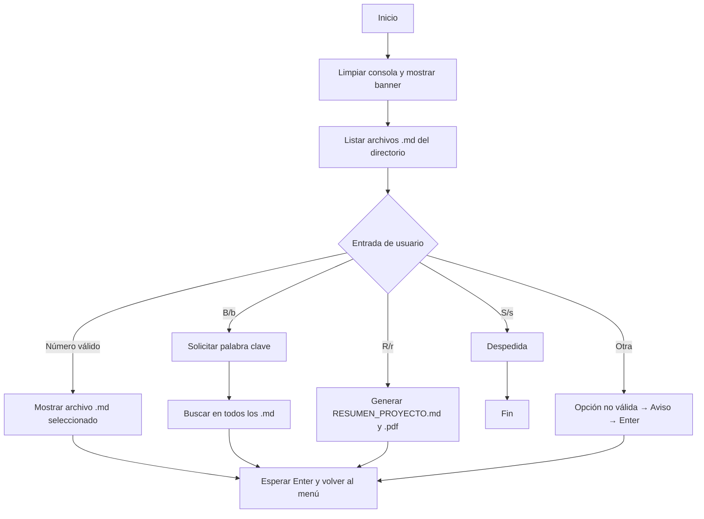

# 🤖 Aurelion IA – Menú Demostrativo de Consultor del Proyecto

> **Materia:** Fundamentos de Inteligencia Artificial  
> **Estudiante:** Alexis Esteban Roldan
> **Propósito:** Presentar un **menú interactivo en consola** para explorar documentación del proyecto, **buscar palabras clave** y **generar un resumen ejecutivo** en **Markdown y PDF**.  

---

## 🧭 Visión general

Este programa implementa una **aplicación de consola** que funciona como un *consultor del proyecto* para navegar por archivos **Markdown (`.md`)** ubicados en el directorio raíz. Su objetivo es **facilitar la lectura, búsqueda y síntesis** de conocimiento del proyecto “Aurelion IA”.

**Tecnologías usadas:**
- Python 3.10+
- rich para UI en consola (tablas, estilos, Markdown).
- reportlab para exportar un **resumen automático en PDF**.

---

## ✨ Funcionalidades principales

- 📂 **Listado dinámico** de todos los archivos `*.md` del directorio del proyecto.
- 👓 **Visualización formateada** de un archivo `.md` con *render Markdown* en consola.
- 🔎 **Búsqueda global** de una palabra/expresión en **todos** los `.md` y reporte de coincidencias.
- 🧾 **Resumen ejecutivo** autogenerado del proyecto en **`RESUMEN_PROYECTO.md`** y **`RESUMEN_PROYECTO.pdf`**.
- 👋 **Salida** segura del sistema con mensaje final.


---

## 🗺️ Flujo del programa (diagrama)



---

## 🔧 Requisitos

- Python **3.10+**
- Sistema operativo: Windows / Linux / macOS
- Módulos Python:
  - `rich`
  - `reportlab`

> Verifica la versión de Python:  
> ```bash
> python --version   # o python3 --version
> ```

---

## ⚙️ Instalación y ejecución (paso a paso)

1) **Clonar o copiar** el proyecto a una carpeta local.  
2) *(Opcional pero recomendado)* Crear un entorno virtual:
   ```bash
   # Windows (PowerShell)
   python -m venv .venv
   .\.venv\Scripts\Activate.ps1
   
   # Linux/macOS
   python3 -m venv .venv
   source .venv/bin/activate
   ```
3) **Instalar dependencias:**
   ```bash
   pip install rich reportlab
   ```
4) **Colocar tus archivos `.md`** en el **directorio raíz** del proyecto (junto a `main.py`).  
5) **Ejecutar la app:**
   ```bash
   # Windows
   python main.py
   # Linux/macOS
   python3 main.py
   ```

---

## 🧪 Uso del menú

Al iniciar, verás un banner y una lista numerada de los `.md` disponibles. Puedes:

- Escribir **el número** de un archivo para **verlo en consola** (render Markdown).
- Presionar **B** para **buscar** una palabra/expresión en **todos** los `.md`.
- Presionar **R** para **exportar un resumen ejecutivo** (`.md` y `.pdf`).
- Presionar **S** para **salir**.

**Ejemplo de interacción:**
```
🤖 CONSULTOR DEL PROYECTO AURELION

1. dataset.md
2. informacion-del-programa-python.md
3. informacion-del-proyecto.md
4. Tienda-Aurelion.md

B. Buscar palabra clave en todo el proyecto
R. Exportar resumen automático del proyecto
S. Salir

👉 Opción: r
✅ Archivos 'RESUMEN_PROYECTO.md' y 'RESUMEN_PROYECTO.pdf' generados con éxito 💼🚀.
```

---

## 🧩 Estructura lógica del código (explicada)

- `listar_archivos_md()` → Recorre el **directorio actual** (`os.getcwd()`) y devuelve todos los archivos que **terminan en `.md`**.
- `mostrar_archivo(path)` → Limpia la consola, imprime un **título** bonito con `rich.console.Console.rule`, **renderiza el Markdown** del archivo y espera `Enter`.
- `buscar_en_archivos(palabra)` → Abre **cada `.md`**, normaliza a minúsculas y **busca coincidencias** de la palabra/expresión; acumula los nombres de archivo donde se encontró.
- `exportar_resumen()` → Genera un **Markdown ejecutvo** con puntos clave de cada `.md` y lo exporta también a **PDF** usando `reportlab`.
- `menu()` → **Bucle principal**: pinta el menú, **lee la opción** del usuario y delega según corresponda (ver diagrama).

---

## 🧾 Pseudocódigo del programa

```text
INICIO
    definir PROJECT_PATH = directorio_actual
    mientras (verdadero):
        limpiar_consola()
        mostrar_banner("CONSULTOR DEL PROYECTO AURELION")
        opciones = listar_archivos_md_en(PROJECT_PATH)
        mostrar_opciones(opciones)  # 1..N, más B, R, S
        eleccion = leer_entrada_usuario()

        si eleccion es "s" o "S":
            mostrar("Hasta luego")
            SALIR

        si eleccion es "b" o "B":
            palabra = pedir_texto("Ingresar palabra a buscar")
            resultados = []
            PARA cada archivo EN opciones:
                contenido = leer(archivo).to_lower()
                SI palabra.to_lower() EN contenido:
                    agregar archivo a resultados
            SI resultados NO vacíos:
                mostrar("Encontrado en", resultados)
            SINO:
                mostrar("No se encontró en ningún archivo")
            esperar_enter()
            CONTINUAR

        si eleccion es "r" o "R":
            resumen = construir_resumen_desde(opciones)
            guardar("RESUMEN_PROYECTO.md", resumen)
            exportar_pdf("RESUMEN_PROYECTO.pdf", resumen)
            informar_exito()
            esperar_enter()
            CONTINUAR

        si eleccion es un número válido ENTRE 1 y len(opciones):
            archivo = opciones[eleccion - 1]
            limpiar_consola()
            mostrar_markdown(archivo)
            esperar_enter()
            CONTINUAR

        SINO:
            mostrar("Opción no válida")
            esperar_enter()
            CONTINUAR
FIN
```

---


## 🛠️ Detalles de implementación destacables

- `rich.Markdown` brinda soporte para **encabezados, listas, código y énfasis** directamente en terminal.
- `reportlab` se usa con `canvas.Canvas` para **paginación básica** y pintar líneas del resumen (acota longitud para evitar desbordes).
- El **ámbito del proyecto** se controla con `os.getcwd()`, lo que facilita ejecutar el script **dentro de la carpeta** con la documentación.

---

## 🧯 Troubleshooting

- **La consola no muestra colores/estilos:** prueba en otra terminal (Windows Terminal, PowerShell, iTerm2) o actualiza `rich`.
- **PDF se corta o desborda:** el exportador delimita ~100 caracteres por línea; si tu contenido es muy ancho, ajusta el tamaño de fuente o el *wrap* en `reportlab`.
- **No aparecen archivos en el menú:** confirma que hay **`.md` en el mismo directorio** donde ejecutas `main.py`.
- **Encoding UTF-8:** asegúrate de guardar tus `.md` en UTF-8 para acentos/emoji correctos.

---


## ▶️ Comandos rápidos

```bash
# Crear venv (Windows)
python -m venv .venv && .\.venv\Scripts\Activate.ps1
# Crear venv (Linux/macOS)
python3 -m venv .venv && source .venv/bin/activate

# Instalar dependencias
pip install rich reportlab

# Ejecutar
python main.py
```

---

## 📚 Ejemplo de directorio del proyecto

```
/Aurelion-IA-Consultor
├── main.py
├── Tienda-Aurelion.md
├── dataset.md
└── Informacion-del-programa-python.md
└── Informacion-del-proyecto.md

```
