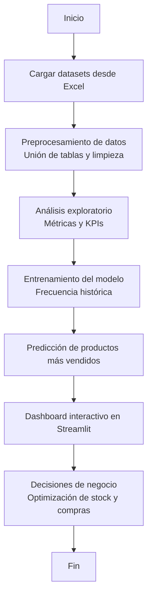

# 🚀 Información, Pasos, Pseudocódigo y Diagrama del Programa de la Solución Propuesta

---

## 🧩 Descripción General del Sistema

La solución propuesta para la tienda **Aurelion** consiste en un sistema híbrido que integra:

### 1. 📊 Dashboard Interactivo (con *Streamlit*)
Visualiza:

- 📅 Ventas totales por período  
- 📦 Productos más y menos vendidos  
- 🧮 Comparativa entre categorías  
- 👥 Clientes más activos  

### 2. 🔮 Modelo Predictivo (frecuencia histórica de ventas)
Permite identificar los productos con mayor probabilidad de ser demandados en el próximo período (ej: próximo mes).  
Se utiliza un enfoque basado en el análisis del volumen histórico de ventas, con algoritmos simples de clasificación/regresión de *Scikit-learn* para generar un ranking.

✅ El sistema transforma los datos en información estratégica para:

- Optimización del stock  
- Planificación de compras  
- Toma de decisiones proactivas  

---

## ⚙️ Pasos del Flujo Funcional y Técnico

### 1. 🗂️ **Carga de Datos**
- Importar datasets desde Excel: `clientes.xlsx`, `productos.xlsx`, `ventas.xlsx`, `detalle_ventas.xlsx`
- Validar formatos y claves primarias/foráneas

### 2. 🧼 **Preprocesamiento**
- Unir las tablas (`ventas` + `detalle_ventas` + `productos`)
- Manejo de valores nulos y verificación de tipos de datos

### 3. 🔍 **Análisis Exploratorio**
- Cálculo de métricas clave: ventas por producto, categoría, cliente y período
- Identificación de outliers y estacionalidades

### 4. 🧠 **Construcción del Modelo Predictivo**
- Variables utilizadas: `id_producto`, `cantidad_total_vendida`, `frecuencia_compra`
- Entrenamiento de modelo (*RandomForestClassifier* o *Regresión Lineal*)
- Generación de ranking de productos más demandados

### 5. 📈 **Visualización en Dashboard**
- KPIs de ventas y clientes  
- Gráficos interactivos (barras, líneas)  
- Sección especial: *Top N productos más vendidos (histórico + predicción)*

### 6. 🔄 **Predicción y Actualización**
- Ejecución periódica
- Nuevos datos actualizan el modelo y el dashboard

---

## 🧮 Pseudocódigo del Programa

```python
# 1. Carga de datos
clientes = read_excel("clientes.xlsx")
productos = read_excel("productos.xlsx")
ventas = read_excel("ventas.xlsx")
detalle = read_excel("detalle_ventas.xlsx")

# 2. Preprocesamiento
dataset = merge(ventas, detalle, on="id_venta")
dataset = merge(dataset, productos, on="id_producto")

# 3. Análisis exploratorio
ventas_por_producto = group_by(dataset, "id_producto").sum("cantidad")
ranking_historico = sort(ventas_por_producto, by="cantidad", descending=True)

# 4. Preparación del modelo predictivo
X = features(ranking_historico, ["cantidad", "precio"])
y = target(ranking_historico, "producto_mas_vendido")

X_train, X_test, y_train, y_test = split(X, y, test_size=0.2)

# 5. Entrenamiento del modelo
modelo = RandomForestClassifier()
modelo.fit(X_train, y_train)

# 6. Predicción de productos más vendidos
predicciones = modelo.predict(X_test)
top_predichos = get_top(predicciones, N=5)

# 7. Visualización en dashboard con Streamlit
show_dashboard(
    kpi_total_ventas,
    grafico_top_productos(ranking_historico),
    grafico_predicciones(top_predichos)
)

```

# 📌 Diagrama del Flujo del Sistema



